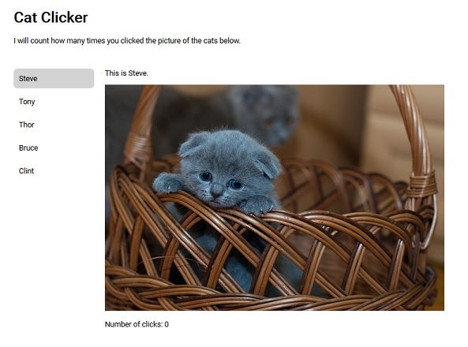

# Cat Clicker

The application shows pictures of several cats and number of clicks to the 
cat pictures. It is implemented using the Model-View-Octopus design pattern.

----

_A working directory for learning about Javascript Design Patterns._

